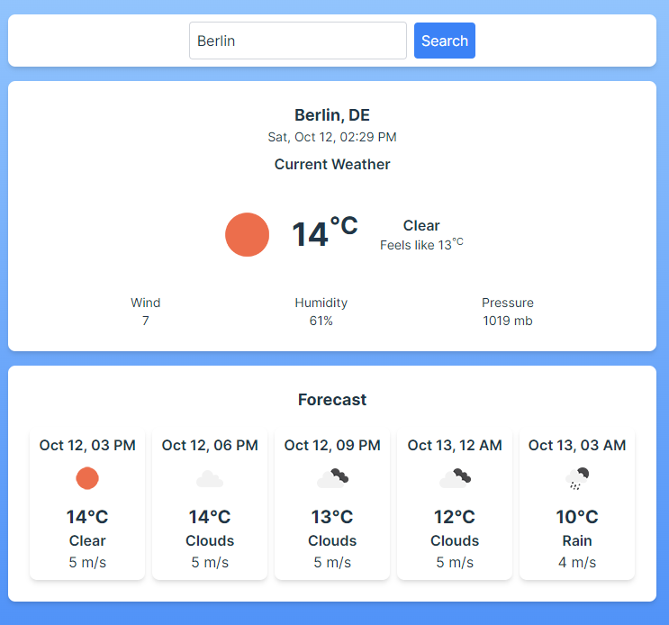

# Weather App (React)

This is a weather application built using **React** with **Vite**, styled using **Tailwind CSS**, and fetching weather data from the **OpenWeather API**.

The app utilizes the `navigator.geolocation` object to retrieve the user's current location, and a custom hook `useGeolocation` was created to handle and provide the user's coordinates. The app also leverages **Axios** for API requests, **Tanstack Query** (formerly React Query) for data fetching and caching, **JSX** for structuring components, and **React Hooks** for state and effect management.

## Features

- Displays current weather based on city input or user's location.
- Shows temperature, weather conditions, humidity, and wind speed.
- Uses `navigator.geolocation` to detect the user's current position.
- Custom `useGeolocation` hook for managing geolocation data.
- Utilizes **Axios** for handling API requests.
- Uses **Tanstack Query** for efficient data fetching and caching.
- Custom `useFetchWeather` hook for managing weather data.
- Built with **JSX** and **React Hooks** (useState, useEffect) for smooth component management.
- Responsive design using Tailwind CSS.
- Fetches data from the OpenWeather API.

## Demo

You can view a live demo of the app [here](https://dzmitryur.github.io/weather-app-react/).

## Watch on YouTube:

You can watch a YouTube video on how to build Weather App

<div align="left">
      <a href="https://youtu.be/rJqAmxqKNiw">
         
      </a>
</div>

## Screenshots



## Technologies Used

- **React**: Front-end framework
- **Vite**: Development build tool for fast project setup
- **Tailwind CSS**: Utility-first CSS framework for styling
- **OpenWeather API**: Provides weather data
- **Axios**: Promise-based HTTP client for making requests to the OpenWeather API
- **Tanstack Query**: Data fetching, caching, and synchronization for handling asynchronous operations
- **JSX**: Syntax extension for writing HTML in JavaScript
- **React Hooks**: Custom and built-in hooks for managing component logic (e.g., `useGeolocation`, `useFetchWeather`, `useState`, `useEffect`)
- **navigator.geolocation**: To access the user's current coordinates

## Installation and Setup

To get a local copy up and running, follow these steps:

### Prerequisites

Make sure you have the following installed:

- [Node.js](https://nodejs.org/)
- [Vite](https://vitejs.dev/)

### Installation

1. Clone the repository:

   ```bash
   git clone https://github.com/DzmitryUr/weather-app-react.git
   cd weather-app-react
   ```

2. Install dependencies:

   ```bash
   npm install
   ```

3. Create a .env.local file at the root of the project and add your OpenWeather API Key:

   ```bash
   VITE_API_KEY=your_openweather_api_key
   ```

   You can get your API key by signing up at [OpenWeather](https://openweathermap.org/).

4. Start the development server:

   ```bash
   npm run dev
   ```

5. Open the app in your browser:

   ```bash
   http://localhost:5173
   ```

## Usage

- Enter the name of the city in the search bar or allow the app to access your location.
- The app will display the current weather information including temperature, humidity, and wind speed.
- The weather data is fetched in real-time from the **OpenWeather API** using **Axios**.
- **Tanstack Query** is used for caching and synchronizing the fetched data.
- If location access is granted, the app will use the `useGeolocation` hook to retrieve your coordinates and display the weather for your current location.

## Contributing

If you'd like to contribute, feel free to create a pull request or open an issue to discuss the changes.

## License

This project is licensed under the MIT License.

## Acknowledgements

- [Vite](https://vitejs.dev/)
- [React](https://reactjs.org/)
- [Tailwind CSS](https://tailwindcss.com/)
- [OpenWeather API](https://openweathermap.org/)
- [Axios](https://axios-http.com/)
- [Tanstack Query](https://tanstack.com/query/latest)
- [navigator.geolocation](https://developer.mozilla.org/en-US/docs/Web/API/Geolocation_API)
