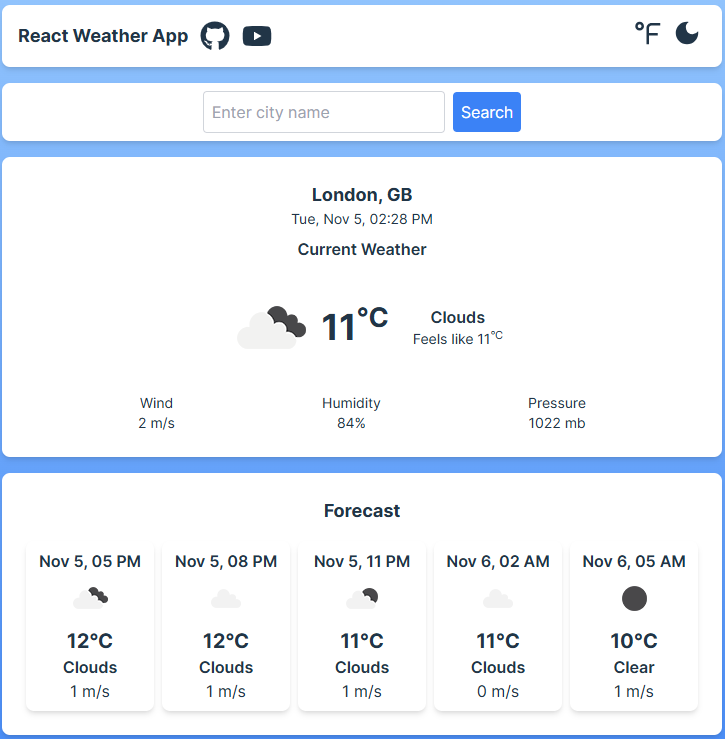

# Weather App (React)

This is a simple weather application built using **React** with **Vite**, styled using **Tailwind CSS**, and fetching weather data from the **OpenWeather API**.

The app utilizes the `navigator.geolocation` object to retrieve the user's current location, and a custom hook `useGeolocation` was created to handle and provide the user's coordinates.

## Features

- Displays current weather based on city input or user's location.
- Shows temperature, weather conditions, humidity, and wind speed.
- Uses `navigator.geolocation` to detect the user's current position.
- Custom `useGeolocation` hook for managing geolocation data.
- Responsive design using Tailwind CSS.
- Fetches data from the OpenWeather API.

## Demo

You can view a live demo of the app [here](https://dzmitryur.github.io/weather-app-react/)

## Screenshots



## Technologies Used

- **React**: Front-end framework
- **Vite**: Development build tool for fast project setup
- **Tailwind CSS**: Utility-first CSS framework for styling
- **OpenWeather API**: Provides weather data
- **navigator.geolocation**: To access the user's current coordinates
- **useGeolocation hook**: Custom React hook to retrieve and manage location data

## Installation and Setup

To get a local copy up and running, follow these steps:

### Prerequisites

Make sure you have the following installed:

- [Node.js](https://nodejs.org/)
- [Vite](https://vitejs.dev/)

### Installation

1. Clone the repository:

   ```bash
   git clone https://github.com/DzmitryUr/weather-app-react.git
   cd weather-app-react
   ```

2. Install dependencies:

```bash
npm install
```

3. Create a .env file at the root of the project and add your OpenWeather API Key:

```bash
VITE_API_KEY=your_openweather_api_key
```

You can get your API key by signing up at [OpenWeather](https://openweathermap.org/).

4. Start the development server:

```bash
npm run dev
```

5. Open the app in your browser:

```bash
http://localhost:5173
```
